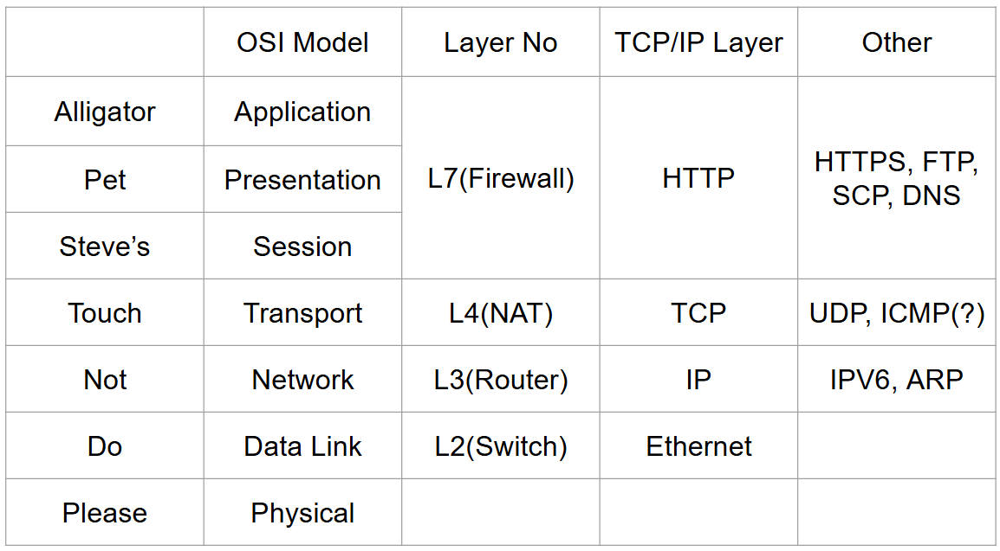

## gilgil_assingment2
## 과제
Ethernet Header의 src mac / dst mac

IP Header의 src ip / dst ip

TCP Header의 src port / dst port

Payload(Data)의 hexadecimal value(최대 20바이트까지만)

출력하기

## 실행
```c
sudo ./pcap-test eth0
```

## example

```shell
sudo ./pcap-test eth0
00:0c:29:aa:ce:11 -> 00:50:56:ff:76:3a, 192.168.205.131:56452 -> 110.11.116.252:80, -
============================
00:50:56:ff:76:3a -> 00:0c:29:aa:ce:11, 110.11.116.252:80 -> 192.168.205.131:56452, 0|0
============================
00:0c:29:aa:ce:11 -> 00:50:56:ff:76:3a, 192.168.205.131:56452 -> 110.11.116.252:80, -
============================
00:0c:29:aa:ce:11 -> 00:50:56:ff:76:3a, 192.168.205.131:56452 -> 110.11.116.252:80, 47|45|54|20|2f|20|48|54|54|50|2f|31|2e|31|d|a|48|6f|73|74
============================
```


